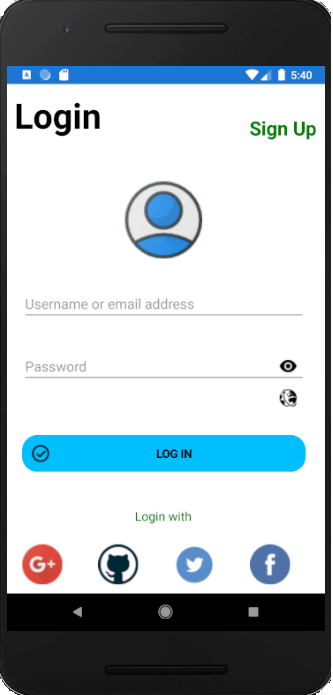
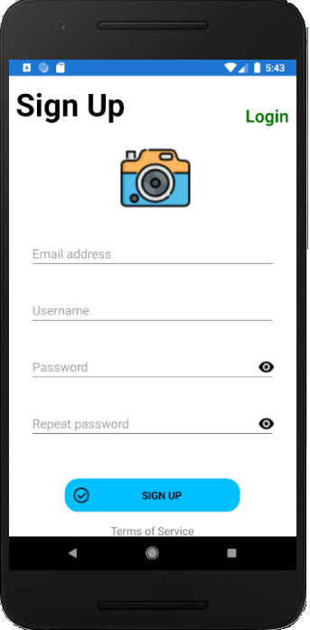
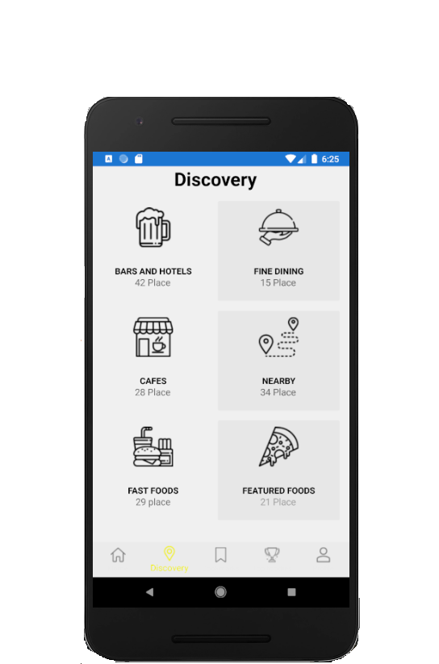

# XamarinFormsMVVM
Refactored previous UI sample app using the MVVM (Model-View-ViewModel) design pattern. Developed in Xamarin Forms for the Mobile app development course at the Instituto Tecnológico de Santo Domingo.  The project contains a Login page, Sign Up page and a Tabbed Page with some other menus. 

<h2 style="text-align: center;"><strong>Login page</strong></h2>

  

<h2 style="text-align: center;"><strong>SignUp page</strong></h2>

 

  
<h2 style="text-align: center;"><strong>Discovery tabbed page</strong></h2>

